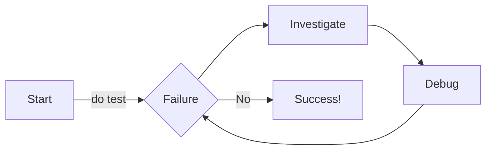

## Content tabs

This is an example of content tabs

### Generic content 

This content will appear as tabs. You can select between them.

=== "Python"

    ```py linenums="1" hl_lines="3-5" title="python-code.py" 
    import os

    weather_api_key = os.environ("WEATHER_API")
    if weather_api_key:
        send_request(weather_api_key)

    ```

=== "C"
    ```C
    #include<stdio.h>

    void main() {
        # I forgot the simple syntax for printing a message in C
    }

    ```

=== "Javascript"
    ```js
    console.log("This is how I imagine javascript")
    ```

This content will appear below the tabs. 

### here is a nice visualization

